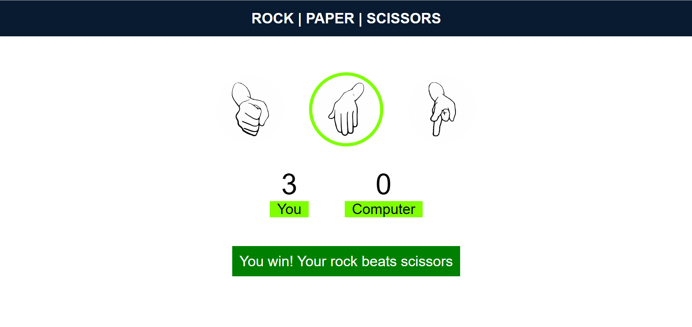

# Stone Paper Scissors Game ✊📄✂️

Welcome to the Stone Paper Scissors game! This is a simple, fun, and interactive web-based game where you can play the classic hand game against a computer opponent.

## Features 🌟

- **Interactive UI**: A clean and responsive interface that works seamlessly on both desktop and mobile devices.
- **Score Tracking**: Real-time score updates for both the player and the computer.
- **Randomized Computer Moves**: The computer opponent makes random choices to keep the game fair and unpredictable.
- **User-Friendly Controls**: Easy-to-use buttons for selecting Stone, Paper, or Scissors.
- **Reset Option**: Ability to reset the game and start over.

## How to Play 🎮

1. **Select Your Move**: Click on the Stone ✊, Paper 📄, or Scissors ✂️ button to make your move.
2. **Computer's Move**: The computer will randomly select its move.
3. **Determine the Winner**: The game will compare your move with the computer's move and display the result.
4. **Score Update**: The scoreboard will update based on the result of each round.


## Technologies Used 🛠️

- **HTML5**: Provides the basic structure of the game.
- **CSS3**: Styles the game with modern, responsive design techniques.
- **JavaScript**: Handles game logic, including user interactions, random computer moves, and score updates.

## Screenshots 📸



## Installation and Setup 🚀

1. **Clone the repository**:
    ```bash
    git clone https://github.com/sumo90/sps.git
    ```
2. **Navigate to the project directory**:
    ```bash
    cd stone-paper-scissors-game
    ```
3. **Open `index.html` in your browser** to start playing the game.

## Contributing 🤝

Contributions are welcome! Please feel free to submit a Pull Request.

## License 📄

This project is licensed under the MIT License.

---

Enjoy playing the Stone Paper Scissors game! If you have any questions or feedback, feel free to reach out.


